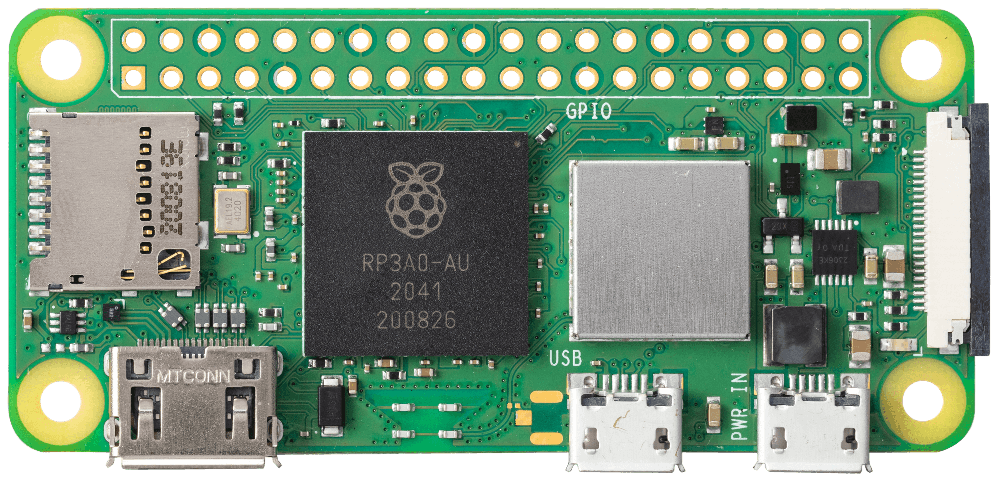
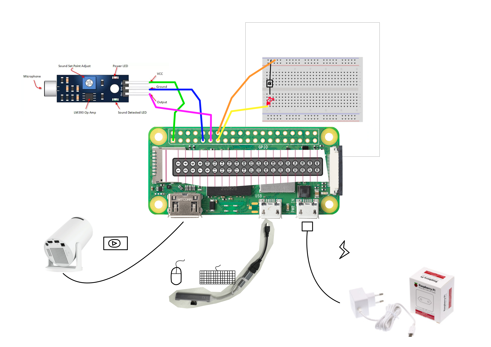
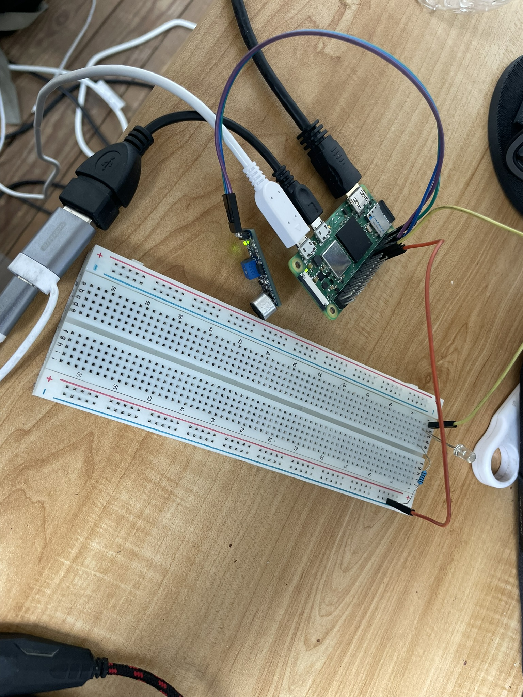

Dit project focust op slaapproblematiek bij jonge kinderen tijdens slaapregressie. Het ontwerp dient als buffer tussen het ontwaken van een kind ’s nachts en de tussenkomst van de ouders. Op die manier moeten ouders minder vaak ontwaken, waardoor de nachtrust minder onderbroken wordt en er overdag minder stress en vermoeidheid ontstaat.

Het product bestaat uit een slimme projector voor de kinderkamer die automatisch activeert wanneer een kind begint te huilen tijdens de nacht. De projector toont zachte, rustgevende visuals op het plafond of de muur om het kind opnieuw te kalmeren en een gevoel van veiligheid te creëren.

Het systeem is ontworpen rond een Raspberry Pi Zero 2 W met header als centrale rekenmodule.

Aan de Raspberry Pi wordt een projector bevestigd aan de HDMI uitgang en worden een microfoon en een breadboard aangesloten op de GPIO pinnen.

De benodigdheden om dit project te maken staan hieronder in een Bill Of Materials.

| **Onderdeel**               |**prijs (€)**|
| -----------------------     | --------------------|
| Mini-videoprojector         | 54,99               |
| Raspberry Pi Zero  2 W      | 20,56               |
| mini HDMI naar HDMI-adapter | 11,90               |
| Voeding (5.1 V 2.5 A)       | 8,82                |
| USB C female naar micro USB male adapter                       | 1,08                |
|USB C naar USB A hub         | 7,99                |
|Philips 16GB micro SD        | 9,95                |
|Breadboard                   | 4,99                |
| **Totaal**                  | **120,28**        |

Wanneer al deze onderdelen aan elkaar geconnecteerd worden bekom je: 

Het breadboard dient in deze schakeling enkel voor visuele feedback, zo is het snel duideijk dat de projector zal projecteren. Dit is nodig omdat de Raspberry pi in combinatie met de projector zorgt voor latency, waardoor het uitgangssignaal wat vertraging heeft.

Uiteindelijk was [dit filmpje](./filmpje%20opktech.mp4) Het uiteindelijke resultaat dat bekomen was.
